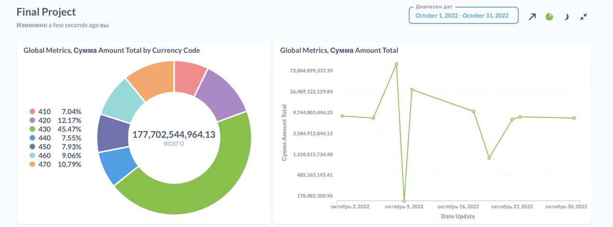
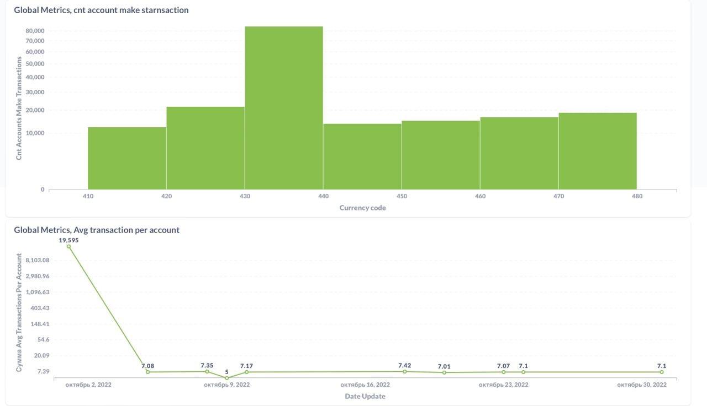
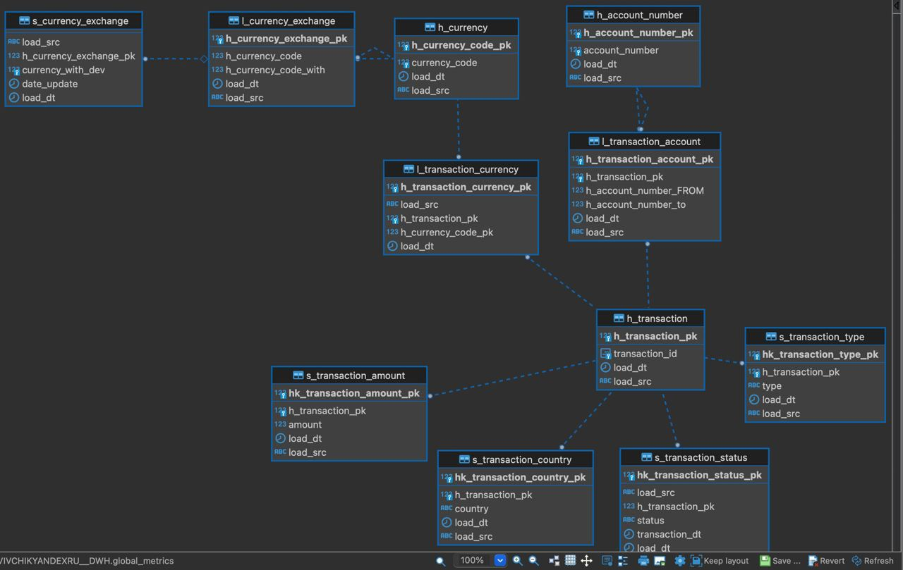

# Дашборд Metabase






1. По поводу проекций. Не совсем понял почему у меня их нет, если смотреть ddl
например transaction то видно следующее:
```-- IVIVCHIKYANDEXRU__STAGING.transactions definition

CREATE TABLE IVIVCHIKYANDEXRU__STAGING.transactions
(
    operation_id uuid NOT NULL,
    account_number_from int NOT NULL,
    account_number_to int NOT NULL,
    currency_code int NOT NULL,
    country varchar(100) NOT NULL,
    status varchar(15) NOT NULL,
    transaction_type varchar(30) NOT NULL,
    amount int NOT NULL,
    transaction_dt timestamp NOT NULL
)
PARTITION BY ((transactions.transaction_dt)::date) GROUP BY (CASE WHEN ("datediff"('year', (transactions.transaction_dt)::date, ((now())::timestamptz(6))::date) >= 2) THEN (date_trunc('year', (transactions.transaction_dt)::date))::date WHEN ("datediff"('month', (transactions.transaction_dt)::date, ((now())::timestamptz(6))::date) >= 1) THEN (date_trunc('month', (transactions.transaction_dt)::date))::date ELSE (transactions.transaction_dt)::date END);


CREATE PROJECTION IVIVCHIKYANDEXRU__STAGING.transactions /*+createtype(P)*/ 
(
 operation_id,
 account_number_from,
 account_number_to,
 currency_code,
 country,
 status,
 transaction_type,
 amount,
 transaction_dt
)
AS
 SELECT transactions.operation_id,
        transactions.account_number_from,
        transactions.account_number_to,
        transactions.currency_code,
        transactions.country,
        transactions.status,
        transactions.transaction_type,
        transactions.amount,
        transactions.transaction_dt
 FROM IVIVCHIKYANDEXRU__STAGING.transactions
 ORDER BY transactions.operation_id
SEGMENTED BY hash(transactions.operation_id) ALL NODES KSAFE 1;


SELECT MARK_DESIGN_KSAFE(1)
```

```
-- IVIVCHIKYANDEXRU__STAGING.currencies_history definition

CREATE TABLE IVIVCHIKYANDEXRU__STAGING.currencies_history
(
    currency_code int NOT NULL,
    currency_code_with int NOT NULL,
    date_update timestamp NOT NULL,
    currency_with_dev numeric(19,2) NOT NULL
)
PARTITION BY ((currencies_history.date_update)::date) GROUP BY (CASE WHEN ("datediff"('year', (currencies_history.date_update)::date, ((now())::timestamptz(6))::date) >= 2) THEN (date_trunc('year', (currencies_history.date_update)::date))::date WHEN ("datediff"('month', (currencies_history.date_update)::date, ((now())::timestamptz(6))::date) >= 1) THEN (date_trunc('month', (currencies_history.date_update)::date))::date ELSE (currencies_history.date_update)::date END);


CREATE PROJECTION IVIVCHIKYANDEXRU__STAGING.currencies_history /*+createtype(P)*/ 
(
 currency_code,
 currency_code_with,
 date_update,
 currency_with_dev
)
AS
 SELECT currencies_history.currency_code,
        currencies_history.currency_code_with,
        currencies_history.date_update,
        currencies_history.currency_with_dev
 FROM IVIVCHIKYANDEXRU__STAGING.currencies_history
 ORDER BY currencies_history.currency_code,
          currencies_history.currency_code_with
SEGMENTED BY hash(currencies_history.currency_code, currencies_history.currency_code_with) ALL NODES KSAFE 1;


SELECT MARK_DESIGN_KSAFE(1);
```

Проеция создается, другой вопрос, что забыл создать для даты(возможно ты это имел ввиду) 


2. По поводу название таблиц currencies_history. Так как название файлика, в s3 такое, то и при формировании
```
s3_url = f's3://{bucket_name}/{table_name}.csv'
``` 
Я оставил нзвание таблицы такое же(если критично то попралю)

3. По поводу множества таблиц. Да, можно создать финальную витрину на основе просто двух таблиц. Подумал, что правильней для финального проекта будет создать модель данных(использовал data vault так же как мы использовали в 5 спринте аналитические бд в котором как раз и была вертика)

